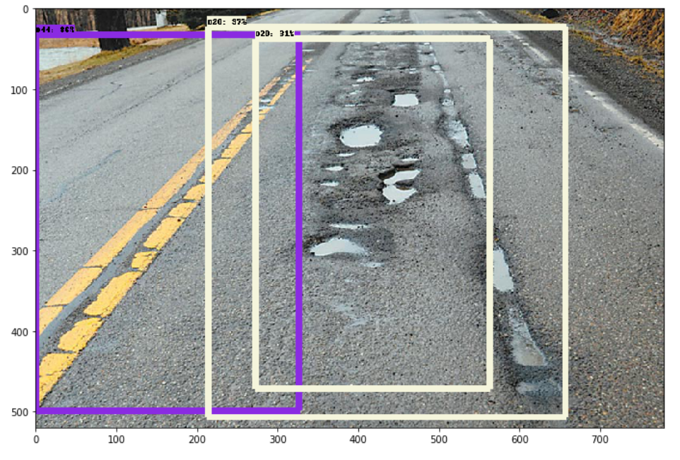

# road_damage_hackaton

### Проект для мониторинга качества дорожного покрытия.

__Краткое описание проекта__:

___Пример определения деффекта___

 

__Аннотация проекта__
В современное время активно проводятся исследования по обнаружению повреждений дорожных покрытий с использованием методов обработки изображений. Такие методы могут показывать достаточно высокое качество при детектировании наличия повреждений. Однако во многих исследованиях внимание уделяется только выявлению наличия повреждения. В реальной жизни, когда руководители дорожно-ремонтных служб или муниципальные органы принимают решение ремонте дорог, им необходимо четко знать тип ущерба, чтобы принять эффективные меры.

Подходом, отличным от визуальной аналитики является качественный анализ. Он основан на масштабном контроле с использованием мобильной измерительной системы (MMS). MMS получает высокоточную геоинформационную информацию с использованием движущегося транспортного средства. Эта система включает в себя блок глобальной системы позиционирования (GPS), внутренний измерительный блок, цифровую камеру и лазерный сканер. Хотя такая инспекция является очень точной, такой мониторинг проводить значительно дороже, особенно для небольших муниципалитетов, которые не имеют необходимых финансовых ресурсов.

Решение, полученное в ходе выполнения даного проекта - качественно новый недорогой подход для сканирования качества дорожного покрытия, который может помочь муниципалитетам для ремонта дорог и автомобилистам для выбора дорожного маршрута с качественным дорожным покрытием.

В основе - наработки коллектива разрабочиков из Токийского университета.

__Статья авторов датасета:__ https://arxiv.org/abs/1801.09454

__Ссылка на датасет:__ https://s3-ap-northeast-1.amazonaws.com/mycityreport/RoadDamageDataset.tar.gz

__Классы повреждений, представленные в датасете:__

          'D00 - linear crack - wheel mark',
          'D01 - linear crack - join part',
          'D10 - linear crack - equal ent',
          'D11 - linear crack - join part',
          'D20 - alligator crack',
          'D40 - rutting bump',
          'D43 - while line blur',
          'D44 - cross walk'

В данной реализации, чтобы не учить сеть с нуля мы используем предобученную VGG модель: https://download.pytorch.org/models/vgg16-397923af.pth

__Фреймфорк:__ pytorch, потом модельку портировали в tensorflow

__Точка входа на обучение__: start_train.py

__Точка входа на предсказания с моделью в видео__: video_prepare.ipynb
